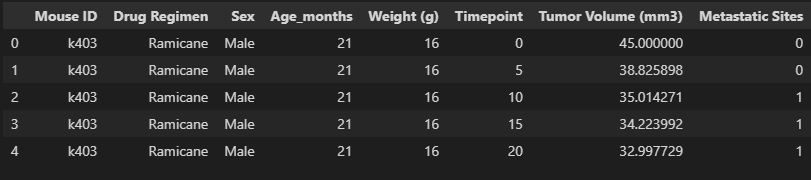
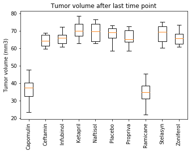
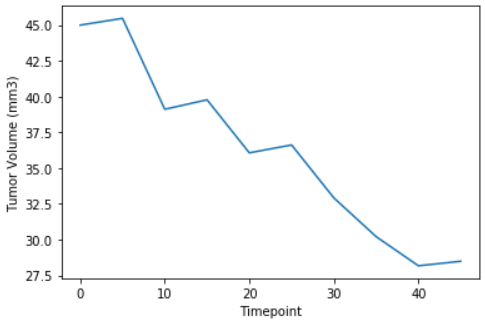

# matplotlib-challenge

## Hypothetical case study: Treatments for squamous cell carcinoma (SCC)

In this study, 249 mice identified with SCC tumor growth were treated through a variety of drug regimens. Over the course of 45 days, tumor development was observed and measured.

### The Goal

We want to obtain the following information:

<ul>
  <li>Merge and clean both datasets</li>
  <li>Summary statistics of every druy regimen</li>
  <li>Plot total number of measurements and distribution of male and female mice </li>
  <li>Get the outliers for each drug regimen and plot them</li>
  <li>Get the Trend of tumor volume at diverse timepoints</li>
  <li>Find if there's a correlation between mouse weight and tumor volume and obtain the equation that can explain it</li>
</ul>

### The Process

We have two datasets: The first one contains Mouse metadata (Mouse_metadata.csv) while the second contains the study results on each mouse at diverse timepoints (Study_results.csv)

At this point we merged the data from both datasets on "Mouse Id" label

We obtained the duplicated Values and then removed them from the dataset, as it was only one Mouse ID. with this step the dataset was clean

#### Summary Statistics

We obtained the mean, median, variance, standard deviation, sem, and count of the of times each drug was used. We used two methods: Groupby and Aggregation method. we obtained the following results.

#### Plotting total number of measurements and distribution of male and female mice

We found that the distribution of female and male mice was almost even

Also, we found that the most used drugs were Capomulin and Ramicane

#### Get the outliers for each drug regimen and plot them

After filtering the last timepoint on each mouse with their belonging drug regimen, we got the last tumor size. With that information the data was processed with quartiles and obtained the the lower bound and upper bound to find potential outliers. The results were the following>

#### Get the Trend of tumor volume at diverse timepoints

After choosing a mouse we got the trend of Tumor Volume against the timepoints. This in order to see how steep the trend was.

#### Find if there's a correlation between mouse weight and tumor volume and obtain the equation that can explain it

We found that the tumor volume was positively correlated with the mouseweight at **0.85**. Also, the linear regression equation to express this was **y = 1.72x + 2.0** 

